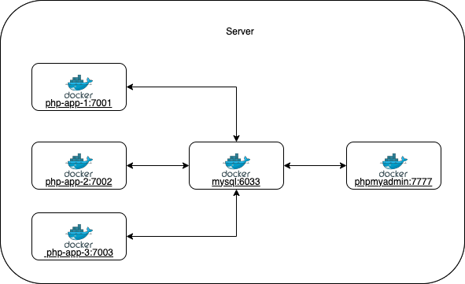

# php-mysql-project-docker


## About
This is only my research, I just want to set up my server that's a bunch of PHP apps, and I want to isolate each app inside a container and those apps will connect to a single database container. I know some tools like cPanel, Plesk, CloudPanel, Cyberpanel, and other open-source/free-to-use software may have more flexibility/capabilities to handle php apps. but it's ok, I need something just like this :D

## Project Structure
```
php-mysql-project-docker                            #
    ├── mysql                                       # root folder for database
    │   ├── docker-compose.yaml                     # docker compose for database
    │   ├── mysql-data                              # mount folder for database to make it persistence
    │   └── mysql.env.example                       # mysql config example to set root password, you can copy and replace with new password
    └── php                                         # php folder for database
        ├── Dockerfile                              # apache2 dockerfile
        ├── docker-compose-crud-php-simple.yaml     # docker compose for project crud-php-simple
        └── projects                                # php project folder, so all php's project will put here
            └── crud-php-simple                     # sample project crud-php-simple root folder (clone/pull from here https://github.com/pobyzaarif/crud-php-simple)
```
